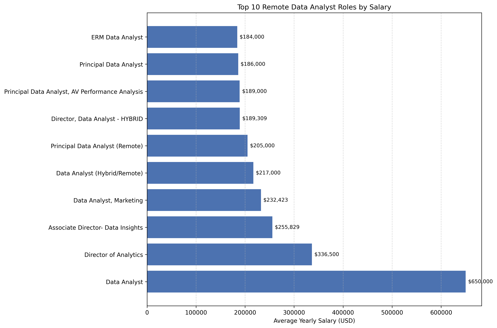

# Introduction
Explore the data analytics landscape: the top-paying roles, the skills that matter, and where high demand meets big salaries.

Check out the SQL queries behind it all: [project_sql folder](/project_sql/)
# Background
This project was born from a desire to explore the data analyst job market in a more insightful and practical way. My goal was to identify top-paying roles, in-demand skills, and the optimal pathways for aspiring data analysts. 

Leveraging SQL skills from my [coursework](https://youtu.be/7mz73uXD9DA?si=aEcHAu1mcMoWznXh), I analyzed job titles, salaries, locations, and key competencies. The key questions I aimed to answer were:

1. Which data analyst roles offer the highest salaries?
2. What skills do these top-paying roles require?
3. Which skills are most in demand among employers?
4. Which skills correlate with higher pay?
5. What are the most strategic skills to learn for career growth?
# Tools I used
For my deep dive into the data analyst job
market. I relied on Several key tools:


- **SQL** - the backbone of my analysis, enabling
me to query the database and extract valuable
insightS.


- **PostgreSQL** -my database management
system of choice, perfectly suited for
handling job posting data.


- **Visual Studio Code** - my go-to environment
for writing and executing SQL queries
efficiently.


- **Git & GitHub** - essential for version control,
collaboration, and tracking the evolution of
my SQL scripts and analysis.
# The Analysis
Each query in this project was designed to explore a specific aspect of the data analyst job market. Here’s how I approached each part:
### 1. Top-paying Data Analyst Jobs
To find the highest-paying positions, I filtered data analyst jobs by average annual salary and location, with a particular focus on remote opportunities in the field.
```SQL
SELECT 
    job_id,
    job_title_short,
    job_location,
    job_schedule_type,
    salary_year_avg,
    job_posted_date,
    c.name
FROM
    job_postings_fact j
LEFT JOIN company_dim c
    ON j.company_id=c.company_id
WHERE
    job_title_short='Data Analyst'AND
    job_location='Anywhere'AND
    salary_year_avg IS NOT NULL
ORDER BY 
    salary_year_avg DESC
LIMIT 10
```
Key Insights:

- Big salary gap: Remote data analyst salaries range from $184K to $650K, showing wide variation even within similar roles.

- Startups pay competitively: Mantys leads with a $650K salary — higher than big tech firms like Meta and AT&T — suggesting smaller companies may offer more to attract remote talent.

- Strong demand for flexibility: The presence of only remote, full-time roles shows that companies are adapting to a workforce that values flexibility without compromising pay.


*Bar Graph visualizing the salary for the top 10 Data Analyst roles; I used Python’s Matplotlib to plot the roles on the y-axis and their average yearly salaries on the x-axis. Salary values are displayed on each bar for easy comparison, showing which remote roles pay the most.*
### 2. Required Skills for Data Analyst Jobs
To identify the most sought-after skills for high-paying remote data analyst roles, I joined job postings with their associated skills and filtered for positions with a defined average annual salary.

```sql
with skills_name as(
    select job_id,skills_dim.skill_id,skills_dim.skills
    from skills_job_dim
    join skills_dim
    on skills_job_dim.skill_id=skills_dim.skill_id
)
SELECT 
    j.job_id,
    job_title,
    job_location,
    job_schedule_type,
    salary_year_avg,
    job_posted_date,
    c.name,
    skills_name.skills

FROM
    job_postings_fact j
LEFT JOIN company_dim c
    ON j.company_id=c.company_id
JOIN skills_name
    ON j.job_id=skills_name.job_id
WHERE
    job_title_short='Data Analyst'AND
    job_location='Anywhere'AND
    salary_year_avg IS NOT NULL
ORDER BY 
    salary_year_avg DESC
```
Here are the key insights:

- The Associate Director - Data Insights role at AT&T offers a high-paying remote position with an average salary of $255,829.5.

- Core technical skills required are SQL, Python, and R, highlighting the importance of data analysis and statistical expertise.

- Knowledge of cloud platforms and big data tools like Azure, AWS, and Databricks is highly valued for senior remote analytics roles.


### 3. In-Demand Skills
This query revealed the most in-demand skills from job postings, helping to highlight areas that attract the most employer interest.
```sql
SELECT
    count(skills_job_dim.skill_id) as skill_demand,
    skills
FROM
    skills_job_dim
JOIN
    skills_dim ON skills_dim.skill_id=skills_job_dim.skill_id
JOIN
    job_postings_fact ON skills_job_dim.job_id=job_postings_fact.job_id
WHERE
    job_title_short='Data Analyst'
GROUP BY
    skills
order BY skill_demand DESC
limit 10
```

| **Skill**  | **Demand** |
| ---------- | ---------- |
| SQL        | 92,628     |
| Excel      | 67,031     |
| Python     | 57,326     |
| Tableau    | 46,554     |
| Power BI   | 39,468     |
| R          | 30,075     |
| SAS        | 28,068     |
| PowerPoint | 13,848     |
| Word       | 13,591     |
| SAP        | 11,297     |

*Table for the demand for the top 10 skills in data analyst job postings*

Here's the breakdown for the most demanded skills for data analysts: 

- **SQL** leads by a wide margin, appearing in over 92K job postings, confirming its status as a core skill in data-related roles.

- **Excel** and **Python** follow, showing continued demand for both traditional spreadsheet tools and modern programming languages.

- Visualization tools like **Tableau** and **Power BI** have strong demand, highlighting the importance of data storytelling and dashboarding.

- **R** and **SAS** remain relevant but trail behind, reflecting niche use in statistical and enterprise environments.

- Microsoft Office tools (**PowerPoint**, **Word**) still appear frequently, suggesting employers value communication and reporting skills alongside technical expertise.

- **SAP**’s lower count indicates specialized demand mainly in enterprise or business intelligence contexts.
### 4. Skills based on Salary
Exploring which skills offer the highest salaries in data analytics roles.
```sql
SELECT
    ROUND(avg(salary_year_avg), 0) as average_salary,
    skills
FROM
    job_postings_fact
JOIN
    skills_job_dim ON skills_job_dim.job_id=job_postings_fact.job_id
JOIN
    skills_dim ON skills_dim.skill_id=skills_job_dim.skill_id
WHERE
    job_title_short='Data Analyst' AND salary_year_avg IS NOT NULL
GROUP BY
    skills
order BY average_salary DESC
limit 10
```
| **Skill** | **Average Salary (USD)** |
| --------- | ------------------------ |
| SVN       | 400,000                  |
| Solidity  | 179,000                  |
| Couchbase | 160,515                  |
| DataRobot | 155,486                  |
| Golang    | 155,000                  |
| MXNet     | 149,000                  |
| dplyr     | 147,633                  |
| VMware    | 147,500                  |
| Terraform | 146,734                  |
| Twilio    | 138,500                  |

*Table for the top-paying skills for data analysts based on average annual salary*

Here are some quick insights:

- **SVN** leads with a significant salary gap, likely due to specialized, senior-level roles.

- **Solidity** and **Golang** show strong pay for developers skilled in blockchain and backend technologies.

- Tools like **DataRobot**, **MXNet**, and **dplyr** indicate high value in machine learning and data engineering skills.

- **Terraform** and **VMware** highlight the growing payoff for cloud and infrastructure automation expertise.

### 5.Optimal Skills
Exploring the most optimal skills in data analytics—those that combine high demand with high pay.
```sql
WITH demanded_skills AS(
    SELECT
        count(skills_job_dim.job_id) as skill_demand,
        min(skills_dim.skills) as skills,
        skills_job_dim.skill_id
    FROM
        skills_job_dim
    JOIN
        skills_dim ON skills_dim.skill_id=skills_job_dim.skill_id
    JOIN
        job_postings_fact ON skills_job_dim.job_id=job_postings_fact.job_id
    WHERE
        job_title_short='Data Analyst'  AND salary_year_avg IS NOT NULL
        AND job_work_from_home = TRUE
    GROUP BY
        skills_job_dim.skill_id
    order BY skill_demand DESC),

top_paid_Skills AS(
    SELECT
        ROUND(avg(salary_year_avg), 0) as average_salary,
        skills_job_dim.skill_id
    FROM
        job_postings_fact
    JOIN
        skills_job_dim ON skills_job_dim.job_id=job_postings_fact.job_id
    JOIN
        skills_dim ON skills_dim.skill_id=skills_job_dim.skill_id
    WHERE
        job_title_short='Data Analyst' AND salary_year_avg IS NOT NULL
    GROUP BY
        skills_job_dim.skill_id)

SELECT 
    d.skill_id,
    d.skills,
    d.skill_demand,
    p.average_salary
FROM
    demanded_skills d
JOIN
    top_paid_Skills p
ON d.skill_id=p.skill_id
ORDER BY d.skill_demand desc, p.average_salary DESC
LIMIT 25
```
| **Skill**  | **Demand** | **Average Salary (USD)** |
| ---------- | ---------- | ------------------------ |
| SQL        | 398        | 96,435                   |
| Excel      | 256        | 86,419                   |
| Python     | 236        | 101,512                  |
| Tableau    | 230        | 97,978                   |
| R          | 148        | 98,708                   |
| Power BI   | 110        | 92,324                   |
| SAS        | 63         | 93,707                   |
| PowerPoint | 58         | 88,316                   |
| Looker     | 49         | 103,855                  |
| Word       | 48         | 82,941                   |
| Snowflake  | 37         | 111,578                  |
| Oracle     | 37         | 100,964                  |
| SQL Server | 35         | 96,191                   |
| Azure      | 34         | 105,400                  |
| AWS        | 32         | 106,440                  |
| Sheets     | 32         | 84,130                   |
| Flow       | 28         | 98,020                   |
| Go         | 27         | 97,267                   |
| VBA        | 24         | 93,845                   |
| SPSS       | 24         | 85,293                   |
| Hadoop     | 22         | 110,888                  |
| Jira       | 20         | 107,931                  |
| JavaScript | 20         | 91,805                   |
| SharePoint | 18         | 89,027                   |
*Table for the optimal skills in data analytics based on demand and salary.*

Here's a breakdown analysis for the above result:

- **SQL** leads in both demand and pay, making it the most optimal skill for data analysts, followed by **Python**, **Tableau**, and **R**.

- Cloud and big data skills (**Snowflake**, **AWS**, **Azure**, **Hadoop**) offer high salaries but lower demand, representing niche, high-reward opportunities.

- Supporting tools (**Excel**, **PowerPoint**, **Word**, **Sheets**, **Flow**) remain in demand but are less lucrative, mainly aiding reporting and communication.

# What I learned 
Key takeaways from my journey learning SQL and applying it to real-world data:

- Learned to write and optimize SQL queries to extract and manipulate data efficiently.

- Gained skills in joining multiple tables and understanding relational database structures.

- Learned to aggregate, filter, and group data for meaningful insights.

- Developed the ability to analyze real-world datasets and answer business questions.

- Understood best practices for database management and data integrity.

- I Improved problem-solving and logical thinking through hands-on SQL exercises.
# Conclusion
### Insights
1.Top-Paying Data Analyst Jobs

- Remote salaries vary widely ($184K–$650K).
- Startups can pay more than big tech to attract talent.
- Full-time remote roles show strong demand for flexibility.

2.Skills for Top-Paying Jobs

- High-paying roles (e.g., AT&T Associate Director) average $255K.
- Core technical skills: SQL, Python, R.
- Cloud and big data knowledge (Azure, AWS, Databricks) is highly valued.

3.Most In-Demand Skills

- SQL dominates with 92K+ postings.
- Excel and Python remain essential.
- Tableau and Power BI are important for visualization.
- R and SAS are niche but relevant.
- PowerPoint and Word show value for communication.
- SAP demand is specialized.

4.Skills with Higher Salaries

- SVN leads in pay due to specialized senior roles.
- Solidity and Golang are high-paying for blockchain/backend.
- DataRobot, MXNet, dplyr are valuable for ML and data engineering.
- Terraform and VMware offer strong pay in cloud/infrastructure roles.

5.Optimal Skills for Job Market Value

- SQL tops in both demand and pay, followed by Python, Tableau, R.
- Cloud/big data skills (Snowflake, AWS, Azure, Hadoop) are high-pay, lower-demand niches.
- Supporting tools (Excel, PowerPoint, Word, Sheets, Flow) remain useful but less lucrative.

### Closing thoughts
This project improved my SQL abilities and offered valuable insights into the data analytics job market. The results provide guidance on which skills to focus on, especially those in high demand and well-compensated, to make smarter career choices. It also helped me strengthen my analytical and problem-solving skills and serves as a useful reference for aspiring data analysts to understand market trends and plan their learning path effectively.